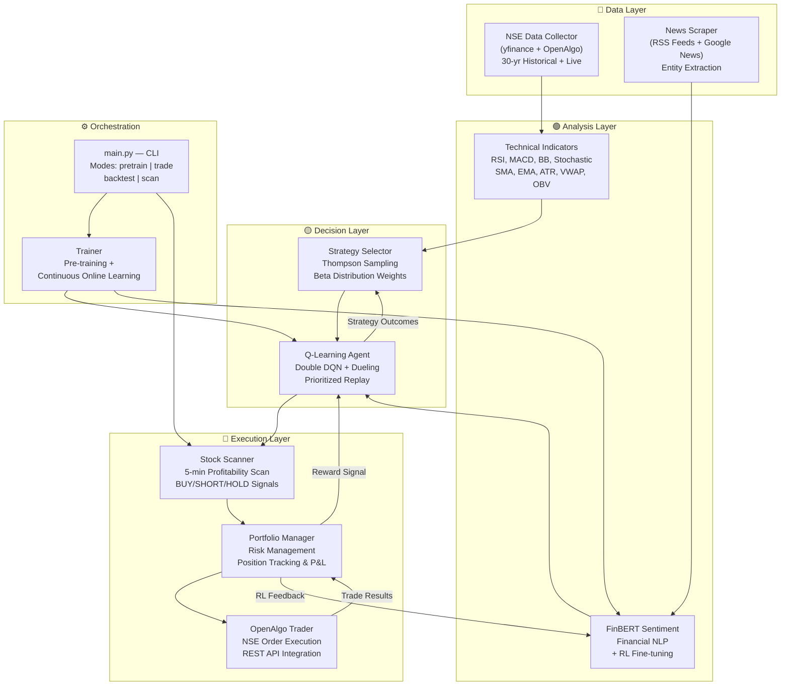
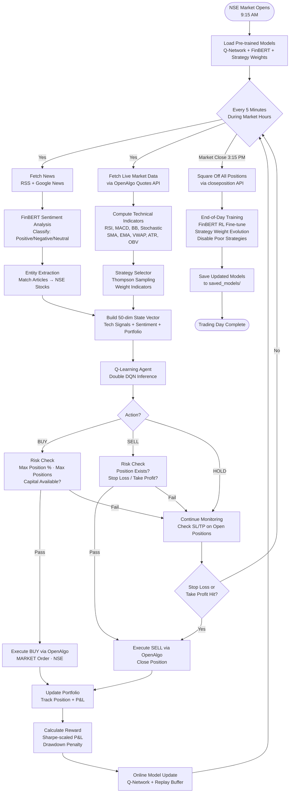
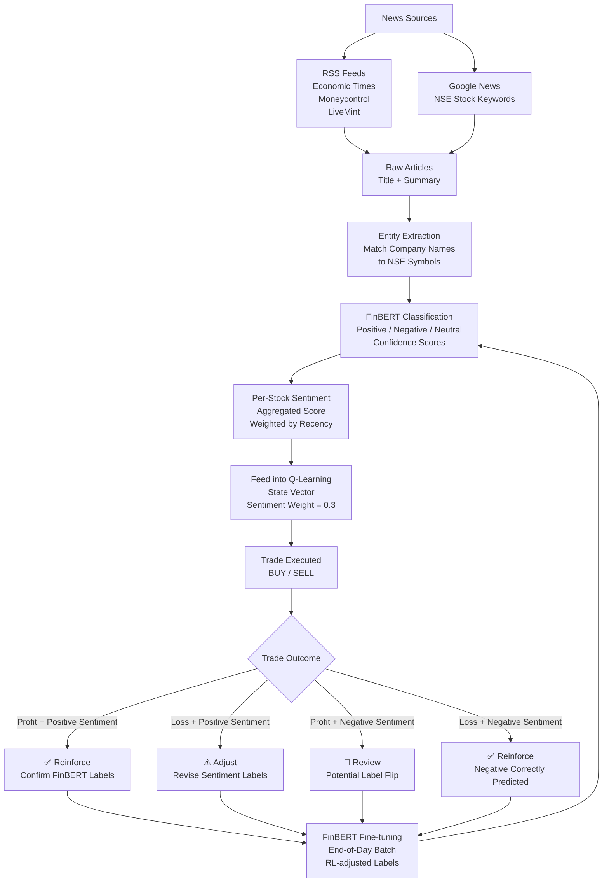
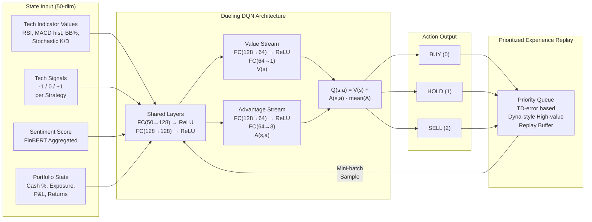

# NSE RL Trader — Design Document & Flowcharts

> **Project**: NSE RL Trader — FinBERT + Deep Q-Learning Trading System  
> **Version**: 1.0  
> **Generated**: April 2026

---

## Table of Contents

1. [System Overview](#1-system-overview)
2. [Architecture Diagram](#2-architecture-diagram)
3. [Module Descriptions](#3-module-descriptions)
4. [Live Trading Decision Flow](#4-live-trading-decision-flow)
5. [Pre-training Pipeline](#5-pre-training-pipeline)
6. [FinBERT Sentiment RL Feedback Loop](#6-finbert-sentiment-rl-feedback-loop)
7. [Thompson Sampling Strategy Selection](#7-thompson-sampling-strategy-selection)
8. [Q-Learning Agent Architecture](#8-q-learning-agent-architecture)
9. [Data Flow Summary](#9-data-flow-summary)
10. [Configuration Reference](#10-configuration-reference)

---

## 1. System Overview

The NSE RL Trader is a reinforcement-learning-based algorithmic trading system targeting the **National Stock Exchange of India (NSE)**. It combines:

- **FinBERT** — a financial-domain BERT model for sentiment analysis on live news
- **Deep Q-Learning (DQN)** — a Double DQN with Dueling architecture and Prioritized Experience Replay for trade decisions
- **Thompson Sampling** — a Bayesian strategy selector that adaptively weights 11 technical indicator strategies
- **OpenAlgo** — a locally-hosted REST API bridge for executing orders through NSE brokers

The system supports four modes: **pre-training** on 30 years of historical data, **live trading** with real-time model updates, **backtesting**, and a **5-minute profitability scanner**.

---

## 2. Architecture Diagram



### Layer Descriptions

| Layer | Purpose |
|-------|---------|
| **Data Layer** | Ingests historical + live market data and news articles |
| **Analysis Layer** | Computes technical indicators and NLP sentiment scores |
| **Decision Layer** | Combines strategy weights and RL inference to decide actions |
| **Execution Layer** | Scans stocks, manages risk, and executes orders via OpenAlgo |
| **Orchestration** | CLI entry point and training pipeline coordination |

### Feedback Loops

- **Reward → Q-Network**: Trade P&L (Sharpe-scaled, drawdown-penalized) updates the DQN online
- **RL Feedback → FinBERT**: End-of-day fine-tuning adjusts sentiment labels based on trade outcomes
- **Strategy Outcomes → Thompson Sampling**: Win/loss from each strategy updates Beta(α, β) distributions

---

## 3. Module Descriptions

### 3.1 Data Layer

| Module | File | Responsibility |
|--------|------|----------------|
| **NSE Data Collector** | `data/nse_data_collector.py` | Downloads 30 years of OHLCV data via yfinance for pre-training. During live trading, fetches real-time quotes via OpenAlgo REST API. |
| **News Scraper** | `data/news_scraper.py` | Scrapes financial news from RSS feeds (Economic Times, Moneycontrol, LiveMint) and Google News. Extracts entities to match articles to NSE stock symbols. Runs every 10 minutes during live trading. |

### 3.2 Analysis Layer

| Module | File | Responsibility |
|--------|------|----------------|
| **Technical Indicators** | `indicators/technical_indicators.py` | Computes 12 indicators: RSI, MACD, Bollinger Bands, Stochastic Oscillator, SMA Crossover, EMA Crossover, VWAP, ATR, OBV, Momentum, CCI, PE Ratio. Each indicator also emits a discrete signal (-1 / 0 / +1). |
| **FinBERT Sentiment** | `models/finbert_sentiment.py` | Runs FinBERT (`ProsusAI/finbert`) to classify article sentiment. Aggregates per-stock scores weighted by recency. Supports end-of-day RL-based fine-tuning where trade outcomes adjust training labels. |

### 3.3 Decision Layer

| Module | File | Responsibility |
|--------|------|----------------|
| **Strategy Selector** | `models/strategy_selector.py` | Uses Thompson Sampling over Beta distributions to learn which of the 12 technical strategies are most profitable. Weights are sampled each tick, normalized, and fed into the state vector. Strategies with win-rate below 20% are auto-disabled. |
| **Q-Learning Agent** | `models/q_learning_agent.py` | Double DQN with Dueling heads. Takes a 50-dimensional state vector (tech values, tech signals, sentiment, portfolio state) and outputs Q-values for BUY(0) / HOLD(1) / SELL(2). Uses Prioritized Experience Replay with TD-error prioritization and a Dyna-style high-value replay buffer. |

### 3.4 Execution Layer

| Module | File | Responsibility |
|--------|------|----------------|
| **Stock Scanner** | `trading/stock_scanner.py` | Runs every 5 minutes during live trading. Computes a composite score blending technical signals, FinBERT sentiment, volume confirmation, and rolling Sharpe ratio. Ranks all NSE stocks as BUY / SHORT / HOLD. |
| **Portfolio Manager** | `trading/portfolio_manager.py` | Tracks open positions, calculates P&L, enforces risk constraints (max position %, max positions, stop-loss at 2%, take-profit at 5%). Squares off all positions at market close (3:15 PM). |
| **OpenAlgo Trader** | `trading/openalgo_trader.py` | Wraps OpenAlgo Python SDK. Places MARKET orders via `placeorder()`, monitors via `positionbook()` and `quotes()`, and closes via `closeposition()`. Supports Analyzer (paper) mode with ₹1Cr virtual capital. |

### 3.5 Orchestration

| Module | File | Responsibility |
|--------|------|----------------|
| **Main** | `main.py` | CLI entry point. Parses arguments for mode (`pretrain`, `trade`, `backtest`, `scan`), capital, API key, host, and paper-trading flag. Orchestrates the full pipeline. |
| **Trainer** | `training/trainer.py` | Coordinates pre-training (episode loop over historical data) and continuous online learning (real-time updates after each trade). |
| **Config** | `config/settings.py` | Centralized configuration via Python dataclasses. All parameters (capital, risk, RL hyperparameters, etc.) defined here. |

---

## 4. Live Trading Decision Flow

This flowchart shows the complete decision cycle during a live NSE trading session (9:15 AM – 3:15 PM):



### Key Decision Points

1. **Every 5 minutes** — parallel fetch of news + market data
2. **Action selection** — Q-Learning agent outputs BUY / HOLD / SELL
3. **Risk gate** — Portfolio Manager validates position limits, capital, and risk constraints before execution
4. **Stop-loss / Take-profit** — continuously monitored on all open positions (2% SL, 5% TP)
5. **Market close** — auto square-off + end-of-day learning cycle

---

## 5. Pre-training Pipeline

```mermaid
flowchart LR
    A[Start Pre-training] --> B[Download 30-Year\nOHLCV Data\nNIFTY 50 via yfinance]
    B --> C[Compute Technical\nIndicators for\nAll Stocks]
    C --> D[Initialize DQN\nDouble DQN +\nDueling Architecture]
    D --> E[Training Loop\nN Episodes]

    subgraph Episode["Each Episode"]
        E1[Reset Environment\nSelect Stock] --> E2[Build State Vector\n50 Dimensions]
        E2 --> E3[Agent Selects Action\nε-greedy: BUY/HOLD/SELL]
        E3 --> E4[Environment Step\nSimulate Trade]
        E4 --> E5[Calculate Reward\nSharpe-scaled P&L]
        E5 --> E6[Store in Prioritized\nExperience Replay]
        E6 --> E7[Sample Mini-batch\nTrain Q-Network]
        E7 --> E8{Episode\nDone?}
        E8 -->|No| E2
        E8 -->|Yes| E9[Update Target Network\nDecay Epsilon]
    end

    E --> E1
    E9 --> F[Optimize Strategy Weights\nThompson Sampling\nBeta Distribution Update]
    F --> G[Save Trained Models\nto saved_models/]
    G --> H[Pre-training Complete]
```



### Pre-training Details

- **Data**: 30 years of daily OHLCV for all NIFTY 50 constituents via yfinance
- **Episodes**: Configurable (default 100). Each episode walks through a stock's history
- **Exploration**: ε-greedy with ε decaying from 1.0 → 0.01
- **Target Network**: Soft-updated periodically to stabilize training
- **Output**: Saved models in `saved_models/` — Q-network weights, strategy Beta parameters, FinBERT checkpoint

---

## 6. FinBERT Sentiment RL Feedback Loop



### Feedback Logic

The RL feedback loop closes the gap between sentiment prediction and actual market impact:

| Sentiment | Trade Result | Action |
|-----------|-------------|--------|
| Positive | Profit | Reinforce — labels confirmed correct |
| Positive | Loss | Adjust — sentiment was misleading, revise labels |
| Negative | Profit | Review — possible label flip needed |
| Negative | Loss | Reinforce — negative sentiment correctly predicted loss |

Fine-tuning runs as an end-of-day batch using the day's accumulated (article, revised_label) pairs.

---

## 7. Thompson Sampling Strategy Selection

```mermaid
flowchart TD
    START[Strategy Selection\nfor Current Tick] --> STRATS

    subgraph STRATS["11 Technical Strategies"]
        S1["RSI\nα=1, β=1"]
        S2["MACD\nα=1, β=1"]
        S3["Bollinger Bands\nα=1, β=1"]
        S4["Stochastic\nα=1, β=1"]
        S5["SMA Crossover\nα=1, β=1"]
        S6["EMA Crossover\nα=1, β=1"]
        S7["VWAP\nα=1, β=1"]
        S8["ATR Breakout\nα=1, β=1"]
        S9["OBV\nα=1, β=1"]
        S10["Momentum\nα=1, β=1"]
        S11["CCI\nα=1, β=1"]
        S12["PE Ratio\nα=1, β=1"]
    end

    STRATS --> SAMPLE[Sample Weight\nfrom Beta&#40;α, β&#41;\nfor Each Strategy]
    SAMPLE --> NORMALIZE[Normalize Weights\nSum = 1.0]
    NORMALIZE --> SIGNAL[Compute Weighted\nComposite Signal\nΣ weight_i × signal_i]
    SIGNAL --> QSTATE[Feed Weighted Signals\ninto Q-Learning State]
    QSTATE --> TRADE[Trade Executed]
    TRADE --> OUTCOME{Profitable?}

    OUTCOME -->|Yes| WIN[Update: α += 1\nIncreases Future\nSampling Probability]
    OUTCOME -->|No| LOSE[Update: β += 1\nDecreases Future\nSampling Probability]

    WIN --> CHECK{Win Rate\n< Threshold?}
    LOSE --> CHECK
    CHECK -->|Below 20%| DISABLE[🚫 Disable Strategy\nRemove from Pool]
    CHECK -->|Above 20%| KEEP[✅ Keep Active]
    DISABLE --> START
    KEEP --> START
```



### How Thompson Sampling Works Here

1. Each of the 11 strategies maintains a **Beta(α, β) distribution** (initialized α=1, β=1 = uniform)
2. At each tick, a weight is **sampled** from each strategy's Beta distribution
3. Weights are **normalized** to sum to 1.0
4. The **composite signal** = weighted sum of individual strategy signals
5. After a trade closes:
   - **Win** → α += 1 (distribution shifts toward higher weights)
   - **Loss** → β += 1 (distribution shifts toward lower weights)
6. Strategies with estimated win-rate α/(α+β) **below 20%** are **disabled** — removed from the active pool

This is an **explore-exploit** mechanism: early on, all strategies are treated equally. Over time, profitable strategies receive higher weights while unprofitable ones are pruned.

---

## 8. Q-Learning Agent Architecture



### Architecture Details

**State Vector (50 dimensions)**:
- Technical indicator raw values (RSI value, MACD histogram, Bollinger Band %, Stochastic K & D, etc.)
- Technical strategy signals (-1 = sell, 0 = neutral, +1 = buy) from each of the 11 strategies
- FinBERT aggregated sentiment score for the current stock
- Portfolio state: cash ratio, position exposure, unrealized P&L, rolling returns

**Dueling DQN**:
- **Shared layers**: Two fully-connected layers (50 → 128 → 128) with ReLU activation
- **Value stream**: FC(128 → 64 → 1) — estimates state value V(s)
- **Advantage stream**: FC(128 → 64 → 3) — estimates advantage A(s, a) for each action
- **Combination**: $Q(s, a) = V(s) + A(s, a) - \frac{1}{|A|}\sum_{a'} A(s, a')$

**Double DQN**: Uses a separate target network to select actions, reducing overestimation bias.

**Prioritized Experience Replay**:
- Transitions stored with priority = |TD-error| + ε
- Higher-error transitions sampled more frequently
- Importance sampling weights correct for bias
- Dyna-style buffer additionally replays high-reward transitions

**Reward Function**:
$$R = \text{Sharpe}(P\&L) \times \Delta\text{PortfolioValue} - \lambda \times \text{Drawdown}$$

---

## 9. Data Flow Summary

```
┌─────────────────────────────────────────────────────────────────────┐
│                         DATA FLOW                                   │
│                                                                     │
│  yfinance ──→ OHLCV Data ──→ Technical Indicators ──┐              │
│                                                      ├──→ State     │
│  RSS/Google ──→ Articles ──→ FinBERT Sentiment ──────┘   Vector    │
│                                                          (50-dim)  │
│                                                            │       │
│                                                            ▼       │
│  Thompson Sampling ──→ Strategy Weights ──→ Q-Learning Agent       │
│                                                   │                │
│                                              BUY/HOLD/SELL         │
│                                                   │                │
│                                                   ▼                │
│                               Portfolio Manager (Risk Gate)        │
│                                                   │                │
│                                                   ▼                │
│                               OpenAlgo ──→ NSE Broker              │
│                                                   │                │
│                                              Trade Result          │
│                                                   │                │
│                          ┌────────────────────────┼────────┐       │
│                          ▼                        ▼        ▼       │
│                    Q-Network              FinBERT       Thompson   │
│                    (Reward)         (Label Adjust)    (α/β Update) │
└─────────────────────────────────────────────────────────────────────┘
```

---

## 10. Configuration Reference

### Risk Management

| Parameter | Default | Description |
|-----------|---------|-------------|
| `initial_capital` | ₹10,000 | Starting capital for trading |
| `max_position_pct` | 10% | Maximum allocation per single stock |
| `max_positions` | 20 | Maximum concurrent open positions |
| `stop_loss_pct` | 2% | Auto-close position if loss exceeds this |
| `take_profit_pct` | 5% | Auto-close position if profit exceeds this |

### RL Hyperparameters

| Parameter | Default | Description |
|-----------|---------|-------------|
| `epsilon` | 1.0 → 0.01 | Exploration rate (ε-greedy), decays during training |
| `learning_rate` | 0.001 | Q-network optimizer learning rate |
| `discount_factor` | 0.95 | γ — future reward discount factor |
| `batch_size` | — | Mini-batch size for replay sampling |
| `replay_buffer_size` | — | Maximum transitions in replay buffer |
| `target_update_freq` | — | Steps between target network updates |

### Sentiment

| Parameter | Default | Description |
|-----------|---------|-------------|
| `sentiment_weight` | 0.3 | Weight of FinBERT score in state vector |
| `news_fetch_interval` | 10 min | How often to scrape news during live trading |

### Trading Schedule

| Event | Time |
|-------|------|
| Market Open | 9:15 AM IST |
| Scanner Interval | Every 5 minutes |
| News Fetch Interval | Every 10 minutes |
| Market Close | 3:15 PM IST |
| EOD Training | After market close |

---

*End of Design Document*
